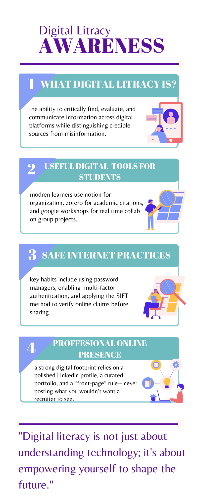

# Presentation

I used Canva to create my design. It illustrates the key components of digital literacy, specifically focusing on safe internet practices and professional online branding. I found it particularly interesting how easily I could use its features to make complex information look visually engaging and professional with minimal effort.

