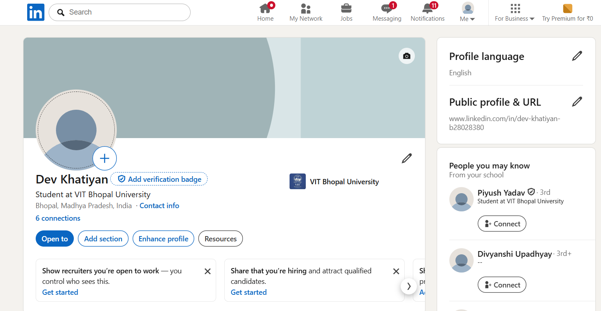

# **Building a Digital Portfolio**

### GitHub: The Digital Portfolio  
**[GitHub](https://github.com)** is the industry standard for *version control* and *collaborative software development*. It is primarily used to host code repositories, track changes using Git, and showcase open-source contributions. For developers, it serves as a **"living resume"** where recruiters can verify technical skills by reviewing actual *code, project architecture, and consistency in coding habits.*  

---

### LinkedIn: The Professional Network  
**[LinkedIn](https://www.linkedin.com/)** is the **world's largest professional social network**, designed for career development and high-level networking. It is used to maintain an online CV, connect with industry peers, and share thought-leadership content. Beyond job hunting, it is a *vital tool* for establishing "social proof" and building a professional brand that extends *beyond* technical capabilities.  

---

### Stack Overflow: The Knowledge Base  
**[Stack Overflow](https://stackoverflow.com)** is a massive **Q\&A community** dedicated to programming and technical troubleshooting. It is used to *find solutions* to specific coding challenges and to *contribute* back to the developer ecosystem. By answering questions, users build a **"reputation"** score that signals deep expertise and a willingness to mentor others *within the tech community.*  

