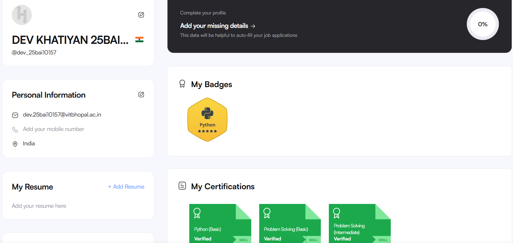
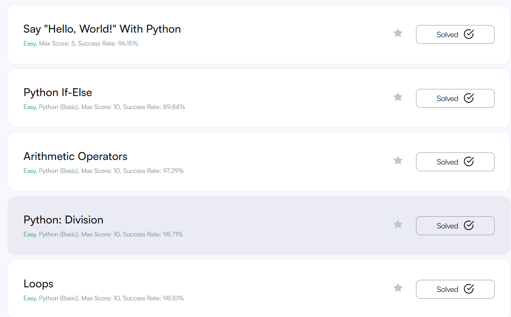

# **Coding \& Collaboration Platforms**

### HackerRank

It is a *competitive coding platform* used for honing **programming skills** and **technical recruitment**. It features *timed challenges and practice tracks* across various domains like **Algorithms and AI**. Companies use it to conduct **remote technical interviews** and assessments, allowing developers to prove their problem-solving proficiency through **real-world coding tasks**.

---

### Profile

I've made my profile on HackerRank as shown in the image below.

---

### Challenges

I started the course of python on HackerRank which involves **various tasks and challenges** related to python environment. I completed some of the following:

